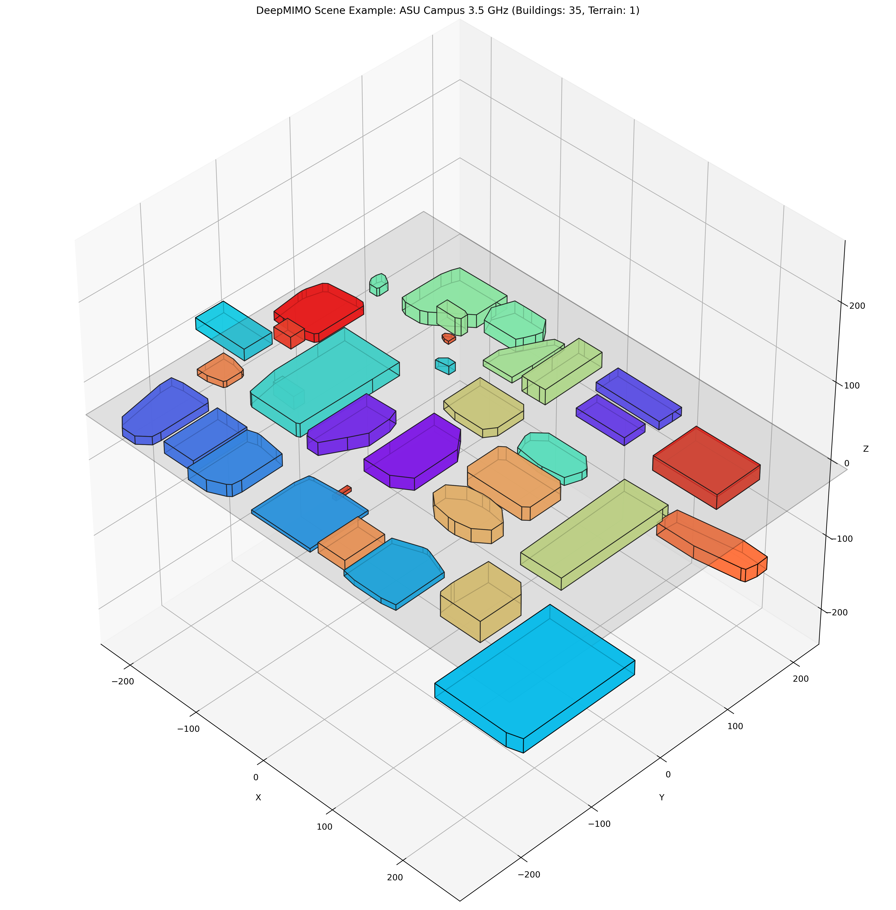
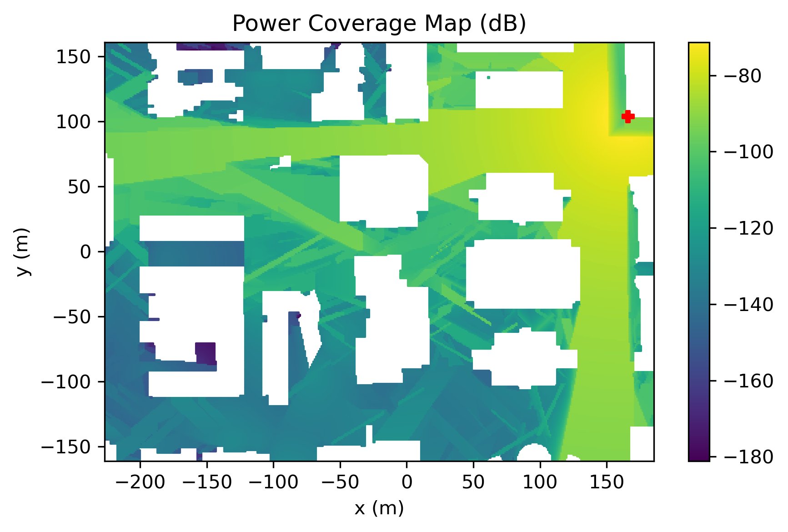
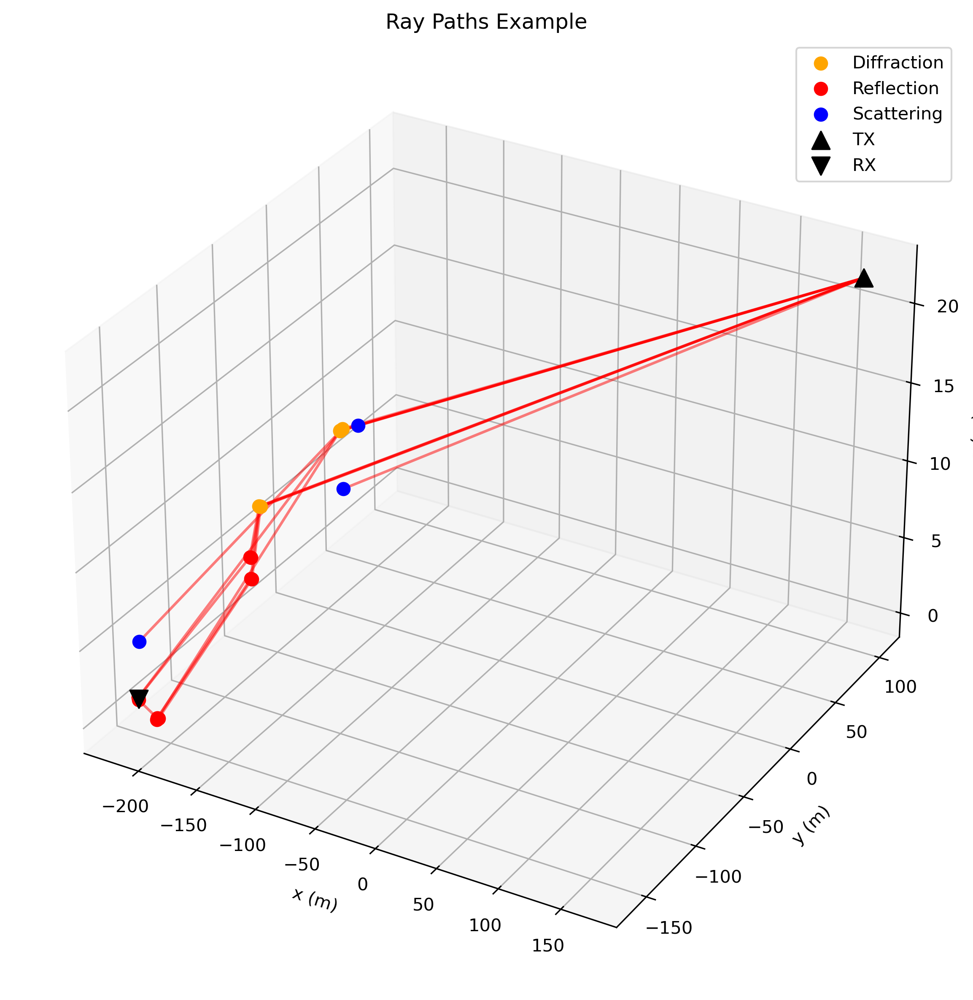

# Quickstart

This guide will help you get started with DeepMIMO quickly.

## Load scenario

Load a scenario and generate channels with default settings:

```python
import deepmimo as dm

# Load a pre-built scenario
dataset = dm.load('asu_campus_3p5')[0]  # [0] selects the BS-users txrx pair

# Plot power coverage map
dataset.plot_coverage(dataset.pwr[:,0])  # [:, 0] selects all users, first path
```

```{tip}
The `dm.load()` function calls `dm.download()` if the scenario is not found in
`./deepmimo_scenarios`. Therefore, this code requires an internet connection.
```

## Compute channels
    
```python
# Generate channels with default parameters
dataset.compute_channels()

# Print channel dimensions: [n_users, n_bs_ant, n_ue_ant, n_freqs]
print(dataset.channels.shape)
```

```{tip}
See the <a href="manual_full.html#channel-generation">Channel Generation Examples</a> for how to configure channel generation.

```

## Plot the scene
```python
dataset.scene.plot()
```



## Visualization Examples

Plot coverage maps and ray paths:

```python
    # Plot power coverage map
    dm.plot_coverage(dataset.rx_pos, dataset.power[:,0], 
                    bs_pos=dataset.tx_pos.T,
                    title="Power Coverage Map (dB)")
```


```python
    # Plot ray paths for user with most paths
    user_idx = np.argmax(dataset.num_paths)
    dm.plot_rays(dataset.rx_pos[user_idx], 
                dataset.tx_pos[0],
                dataset.inter_pos[user_idx], 
                dataset.inter[user_idx],
                proj_3D=True, 
                color_by_type=True)
```



For more advanced usage and features, please refer to the API documentation. 